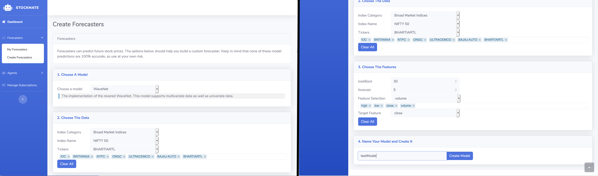

# StockMate

A python based tool to build agents and models for stock price forecasting and trade automation.

`StockMate` is just a temporary name, will change it once I come up with a better one.

## Table of Contents

1. [What is StockMate?](#What-is-StockMate)
    - [Terminology](#Terminology)
    - [UI](#UI)
    - [Frameworks](#Frameworks)
    - [Planned Features](#Planned-Features)
    - [WTF? TF1 and TF2 Together?](#WTF?-TF1-and-TF2-Together?)
2. [Usage](#Usage)
    - [Installation and Setup](#Installation-and-Setup)
    - [Saving Stock Data](#Saving-Stock-Data)
    - [Forecaster Creation](#Forecaster-Creation)
    - [Agent Creation](#Agent-Creation)

## What is StockMate

StockMate is a Python based tool where you can create models for stock price prediction and trade automation. Using StockMate you can use the provided APIs to get the latest stock data, build and test models for forecasting, etc. Currently StockMate's data retrieval is built around India's National Stock Exchange (NSE), and support for other exchanges isn't built yet.

### Terminology

#### 1. Forecasters

Forecasters are a regression models for predicting stock prices. Forecasters can be trained for individual stocks or for entire indices. Basic models have been implemented already and can be used out of the box.

#### 2. Agents

Agents are used to automate trading. Agents decide when to buy, sell or hold stock. Currently there are no free trading apis, so the next best solution for automated trading is to make a chatbot that tells you when to buy and sell.

#### 3. Other Things to Know

1. `forecast` - The number of days in the future for which prices are to be predicted
2. `lookBack` - The number of days to be used to make `forecast` predictions.
3. `interval` - To specify what kind of data the model is going to train on. 1 day interval data or 5 minute intervals, 1 minute intervals ...

#### 3. Data Processing Framework (DPF)

The Data Processing Framework was something that had to be build to make the created models more portable. Think of the model as a black box; Each model will have its own way of handling,

1. The incoming raw stock data
    - Maybe this raw data is normalized, or some other operations are applied to it before being fed to the model
2. The model output
    - The the input was normalized for a regressor, the model output would have to be de-normalized to get back the predicted prices

These two functionalities have been abstracted out of the model and incorporated into a `Data Processing Framework (DPF)`. Basically what this means is that, to create a model you would have define your own DPF by inheriting `Core.DataProcessor` and overriding the following methods,

1. `inputProcessor()`
2. `outputProcessor()`

Please check the documentation under `Core.DataProcessor` to see what the parameters that are passed into it and what the expected outputs are.

Also, a few DPFs have already been implemented for handing univariate and multivariate stock data respectively. You can find them under `Examples/Processors/BasicProcessors.py`

### UI

Currently, the implemented features for StockMate include

#### UI Forecaster Creation



#### Viewing Forecasters


The following models have been implemented,

### Viewing Agent Actions


### Chatbot Features


#### Forecasters

1. ANN.BasicRegressor
2. ANN.DenseRegressor
3. LSTM.BasicLSTM
4. LSTM.DenseLSTM
5. CNN.BasicCNN
6. CNN.WaveNet

#### Agents

1. QLearning.BasicDQN

### Frameworks

1. A Framework for creating forecaster models
2. Framework for agent creation
3. Data processing framework

### Planned Features

1. Packaging this repo
2. Creating Agents through the UI
3. Additional customization for viewing models in the UI
4. Implementation of additional forecasters and agents

### WTF? TF1 and TF2 Together?

Well yes. The Forecasters use TF2 and Agents use TF1. I tried implementing RL algorithms in TF2, but for the sake of easier coding they have compromised on speed. Yes, I tried the `@tf.function` decorators, and yes I tried `tf.compat.v1.disable_eager_execution()`. No matter what, TF1 was just faster.

How much time did I spend you ask? Well I spent over two week trying to find a way to keep it uniformly TF2. I even raised [an issue](https://github.com/tensorflow/tensorflow/issues/40631#) to Tensorflow. But at the end, for the sake of speed, I sadly had no choice but go with TF1.

To prove my point further, here is a benchmark comparing TF1, TF2 and PyTorch. Here are the results run only on my CPU,

|**Framework**|TF1|TF2|PyTorch|
|---|---|---|---|
|**Time (s)**|9.32|258|42|

Although it would have increased the speeds, I did not build and install tensorflow. The above benchmarks are for 1 epoch of the DQN algorithm.

## Usage

### Prerequisites

1. plotly
2. selenium
3. phantomjs driver
4. tensorflow 2.0 or greater
    - As of June 5th 2020, tensorflow 2.0 has an error when loading a saved model containing LSTM layers. So the workaround for this is to install tf-nightly as they have patched this in this version.
5. lxml
6. python-telegram-bot

### Installation and Setup

It is recommended to use this repo inside a virtual environment. Make sure you are using **Python 3.5 or greater**.

```bash
pip install virtualenv
python -m venv stockmate
source stockmate/bin/activate
```

Installing all the python dependencies dependencies,

```bash
pip install plotly tensorflow lxml selenium flask python-telegram-bot
```

### Saving Stock Data

#### 1. Data retrieval for a single stock (TCS)

```python
from DataStore.APIInterface import YFinance
import pandas as pd

ticker = "TCS"

source = YFinance()

oneDayInterval = source.getIntraDay(ticker)
# The data returned is the entire historical data of TCS with 1 day interval
oneMinuteInterval = source.getInterDay(ticker, "1m")
# The data returned is the past 7 days of 1 minute interval
fiveMinuteInterval = source.getInterDay(ticker, "5m")
# The data returned is the past 60 days of 5 minute interval

# All of the data returned are pandas dataframes

# These limits on how far back it goes are set by the yahoo finance api
```

#### 2. Saving ticker data for an entire index

```python
from DataStore import Indices
from DataStore.APIInterface import YFinance

# For category and index names, check the file saved by running the setup.py file
category = "Broad Market Indices :"
index = "NIFTY 50"

nse = Indices.NSEIndices()
indices = nse.getIndices()

# for a single api key
source = YFinance(autoRotate=True)

constituents = indices["type"][category][index]

for stock in constituents:
    source.saveIntraDay(stock, savePath="DataStore/StockData/)

# The above method saves the stock data in that location directly
```

- AutoRotate is a feature that takes a list of api keys and rotates them so that the daily limit can be breached. It also scrapes a list of proxy addresses so that AlphaVantage doesn't block the source IP.

### Forecaster Creation

```python
from DataStore import Indices
from Examples.Processors import MultiVarProcessor
from Models.Forecasters.CNN import WaveNet

indices = Indices.NSEIndices().getIndices()
category = "Broad Market Indices"
index = "NIFTY 50"

constituents = indices["type"][category][index]

# how many days to look back to make prediction
lookBack = 30
# how many days in future to predict
forecast = 5

# target feature is the feature that we want to predict
# in this case it is the closing price
dpf = MultiVarProcessor(tickers=constituents, features=["Open", "High",
                                                        "Low", "Close",
                                                        "Volume"],
                        lookBack=lookBack, forecast=forecast,
                        targetFeature="Close", interval="1d",
                        isSeq2Seq=True)

model = WaveNet()
model.assignDataProcessor(dpf)
model.buildModel(learningRate=1e-5)
model.train(validationSplit=0.9, epochs=1000, batchSize=64)
# By default, models will save in DataStore/SavedModels/
model.saveModel("waveNetTest")
# saved models can be loaded again by calling 
# model.loadModel("name") and trained/inferenced upon
```

### Agent Creation

```python
from Examples.Processors import DQNProcessor
from Models.Agents.QLearning import BasicDQN

dpf = DQNProcessor(tickers=["IOC"], features=["Close"],
                   lookBack=30, interval="1d")

agent = BasicDQN(initialMoney=10000, gamma=0.95,
                 epsilon=0.5, epsilonDecay=0.99,
                 epsilonMin=0.01, batchSize=32)

agent.assignDataProcessor(dpf)
agent.buildModel(learningRate=1e-5)
agent.train(epochs=200)
agent.saveModel("basicAgent")
# This model can now be viewed in the UI, or you may
# choose to plot it yourself
```
